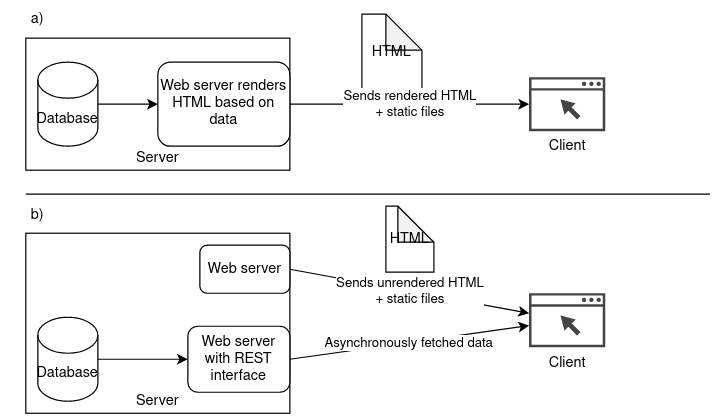
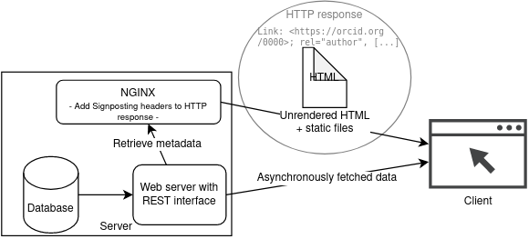

# niginx-signposting-proxy-config

This project demonstrates based on an example how [Signposting](https://signposting.org/) can be added to a data portal where the frontend runs as a JavaScript based Single Page Application ([SPA](https://en.wikipedia.org/wiki/Single-page_application)).

## Background

Signposting is an emerging standard to facilitate the discoverability of linked resources on the web to machine against. The links to related resources are explicitly added in the <HEAD> section on the webpage's HTML or/ and are added as `Link` header values in the HTTP response.

### Problem

While the implementation of this standard is feasible in Web portals, where the frontend HTML is rendered on the server before it is sent to the user, it is much more problematic to implement in data portals where the website is a SPA. In SPAs (which have become increasingly popular due to frameworks like React, AngularJS or VueJS), all HTML content is rendered on the side of the client. This means, that only a very generic, static HTML content is sent to the client (usually a web browser), and afterwards the content is rendered via JavaScript code in the browser. This usually includes asynchronous requests to a (REST) API, where for example the metadata of a dataset is fetched and then displayed to the user in the SPA-based frontend. This asynchronous loading and client-side rendering of the content make implementing Signposting very difficult, because the links that are either sent as an HTTP header or in the HTML head are content specific (e.g., when the HTML represents the landing page of a Digital Object) and therefore based on content-specific metadata which is not known at the moment when the server sends the response to the client.

This problem is comparable to the problem that many SPA-based websites have with respect to adding certain metadata markup to their HTML code in order to optimize the indexability of the website for search engine crawlers. Therefore, the same solutions that are suggested for search engine optimization could also apply here.



Figure 1: Comparison between a) applications where HTML is rendered on the server-side and b) SPAs

### Possible server-side rendering solutions

The first solution for organizations which run a data portal based on a SPA would be to implement [server-side rendering](https://en.wikipedia.org/wiki/Server-side_scripting#Server-side_rendering)(see Fig. 2). This technology usually involves setting up a NodeJS-based server, which runs the JavaScript code on the backend (which includes fetching data from an API) and then delivers the already (fully or semi) rendered HTML code to the server. Here, the signposting headers can be added to the HTML header and/ or HTTP header before sending the response to the client. However, a huge drawback of this technology is that it requires many architectural changes to the code of an existing SPA. This implies a lot of development work in order to add Signposting to an existing data portal by implementing it as a server-side rendered SPA. It is recommendable to include server-side renderings new data portals, that are being developed as an SPA, from the beginning on to have better control over the machine-readable metadata in the HTML.

An alternative to implementing SSR to an existing SPA is to add "pre-rendering". This involves running a headless browser on the server-side to pre-render and send the HTML as static content to the client only for those pages which do not have any dynamic content based on user authentication. This covers all requests by search engine crawlers and other autonomous machine agents. When a user authenticates and sees some other dynamically generated content, the SPA is loaded asynchronously as always. Even though this solution should take less effort in implementing, it probably still requires some changes to the code of an existing data portal.

## Proposed alternative solution

In our use case, adding server-side rendering to the SPA-based Senckenberg's [Wildlive data portal](https://wildlive.senckenberg.de/), a work-in-progress data repository for camera trap observations for biodiversity monitoring, was not feasible it would have required a lot of changes on the application's code structure itself. Instead, we came up with a lightweight method to add Signposting to the landing pages of the camera trap observations. For this, we made use of the fact that Signposting links must not necessarily be included in the HTML header, but are also allowed to be only transported via the HTTP header `Link`. The Wildlive data portal, like many other SPA-based websites, is based on a lightweight webserver, in this case [NGINX](https://nginx.org/), which serves the static files of the website. NGINX with the addional `nginx-module-njs` allows to add custom scripting based on JavaScript code to the webserver configuration. Therefore, we added a custom script which upon a request to the frontend landing page of a certain observation dataset, makes an internal request to the API to retrieve the content-specific metadata. Based on this metadata, the correct Signposting links are generated added to the HTTP response which returns the static HTML to the client (see Fig. 2).



Figure 2: Schematic overview of how Signposting headers are added to the HTTP response in NGINX

### Requirements and configuration

To be able implement this NGINX configuration for adding Signposting to SPAs, first it is required to install `nginx` and the NJS module which allows the exucution of custom script code `nginx-module-njs`. The installation varies on the host system and is described here: [https://nginx.org/en/linux_packages.html](https://nginx.org/en/linux_packages.html). In our case it was necessary to first remove the existing install from the default repository via `sudo apt-get remove --purge 'nginx*'`. Afterwards, the nginx package repository could be configured and the required nginx packages could be installed as described in the Link above.

Finally, we have configured NGINX in the following way:

NGINX confuration file (e.g. page.conf):

```
resolver 1.1.1.1; # Adding the DNS resolver is important as otherwise the HTTP request that
# is executed by NGINX in the JavaScript code will not succeed.
# Attention: Depending on your local network configuration, this might be a different IP than 1.1.1.1

js_path "/opt/www/nginx-custom"; # Path to the folder where the custom NJS code is contained
js_import main from njs/signposting.js; # Relative path to the actual JavaScript file which is in /opt/www/nginx-custom/njs/signposting.js

server {
    listen         80;
    server_name    example.de;
    root /opt/www/static-SPA-dist;

    location ~* \.. { # for all requests for static files (which include a "." in the request, e.g. /styles.css) serve the static content
        try_files $uri $uri/ /index.html;

    }

    location / { # for all other requests to any sublocations of the website (handled by the SPA), serve this
        js_content main.addSignposting ; # serve the content that is returned by the custom JavaScript code
        js_fetch_trusted_certificate /etc/ssl/certs/T-TeleSec_GlobalRoot_Class_2.pem; # If in the JavaScript
        # code the backend is made via HTTPS, NGINX must know the Root certificate for validation
    }
  }

```

And the according file `/opt/www/nginx-custom/njs/signposting.js`:

```javascript
const fs = require("fs");
// the path to the index.html which is served by the SPA
const indexFile = "/opt/www/static-SPA-dist/index.html";
const html = fs.readFileSync(indexFile);

function serializeLinkValue(value, relation, relType, profile) {
  /* build the invidual entries for the signposting link HTTP header*/
  let linkStr = `<${value}> ; rel="${relation}"`;
  if (
    relType !== undefined &&
    typeof relType === "string" &&
    relType.length > 0
  ) {
    linkStr += ` ; type="${relType}"`;
  }
  if (
    profile !== undefined &&
    typeof profile === "string" &&
    profile.length > 0
  ) {
    linkStr += ` ; profile="${profile}"`;
  }
  return linkStr;
}

async function addSignposting(r) {
  /* this function is called by the NGINX js_content directive which passes the
   * HTTP request as r argument */
  // execute the functionality to add custom HTTP headers only if the requested
  // URL matches the path under which the landing pages of dataset are accessed.
  // Otherwise return the default response without any changes (see below)
  if (r.uri.startsWith("/show-object/")) {
    const id = r.uri.replace("/show-object/", "");
    const objectsBaseURI = "https://example.de/api/objects/";
    const apiURI = objectsBaseURI + id;
    // Make a request to the backend API in order to retrieve the object's metadata
    const links = await ngx
      .fetch(apiURI, { timeout: 3000 })
      // In our application there is more relevant metadata contained in the apiURIImages response than
      // in the default apiURI response, which we need to build all the signposting links
      .then((apiResponse) => {
        if (apiResponse.ok) {
          return apiResponse.json();
        }
        throw new Error(
          `Received status code ${apiResponse.status} for object ${id}`
        );
      })
      .then((captureEventObject) => {
        const object = captureEventObject.content;
        const links = [];
        links.push(serializeLinkValue(apiURI, "cite-as"));
        if ("schema:license" in object) {
          links.push(serializeLinkValue(object["schema:license"], "license"));
        }
        if ("schema:author" in object) {
          const authorObject = object["schema:author"];
          if ("@id" in authorObject) {
            links.push(serializeLinkValue(authorObject["@id"], "author"));
          }
        }
        // [...]
        return links;
      })
      .catch((error) => {
        r.error(error);
      });
    // If an error it is logged (see above) and the links variable will be undefined.
    // Only if the API request was successfull the Signposting links are added to the HTTP response
    if (links !== undefined && Array.isArray(links)) {
      r.headersOut["Link"] = links.join(", ");
    }
  }
  r.headersOut["Content-Type"] = "text/html";
  r.return(200, html);
}

export default { addSignposting };
```
